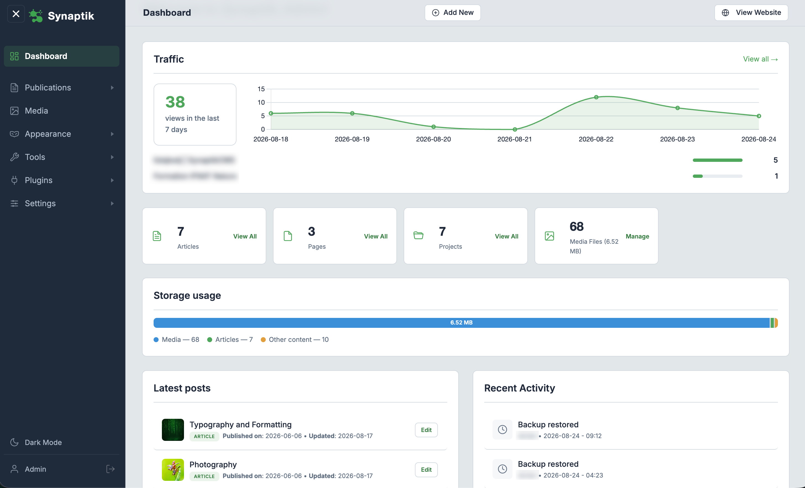
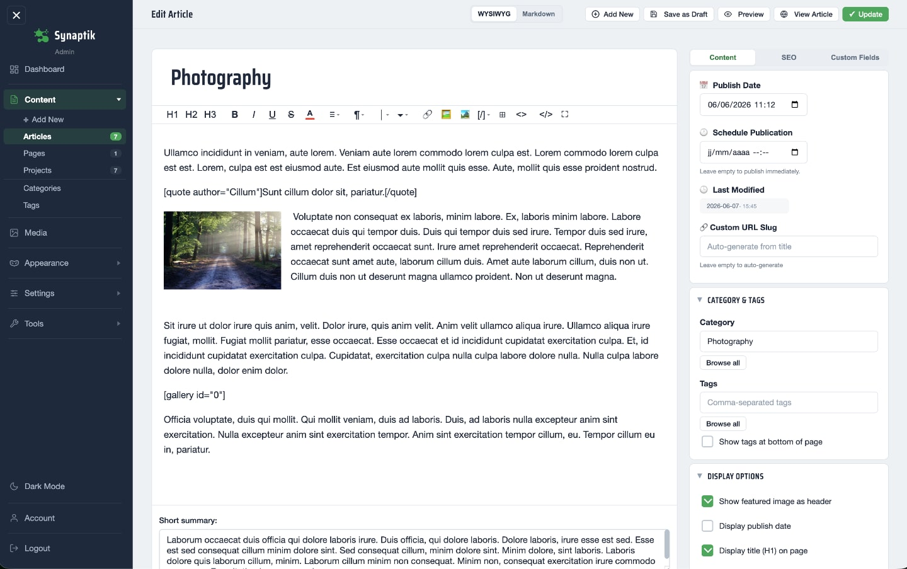
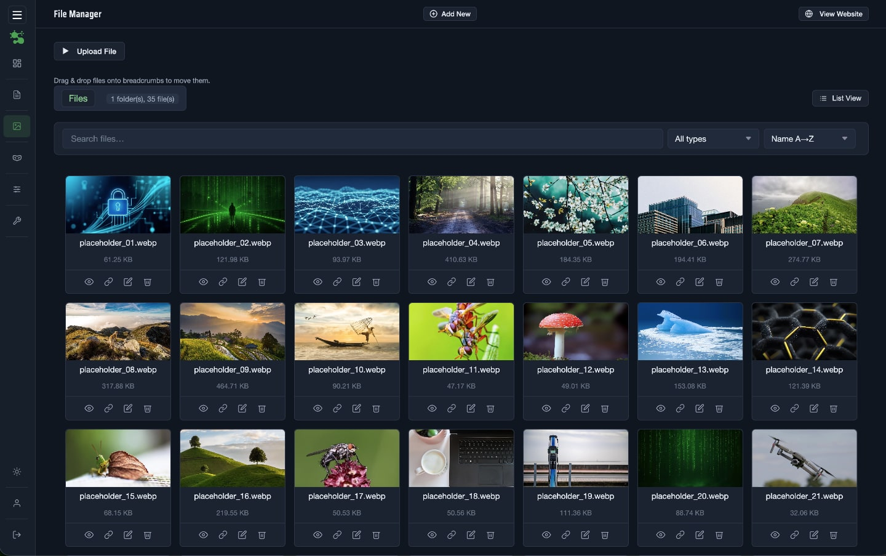
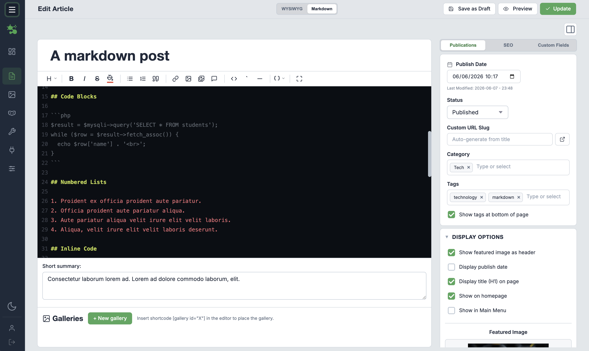
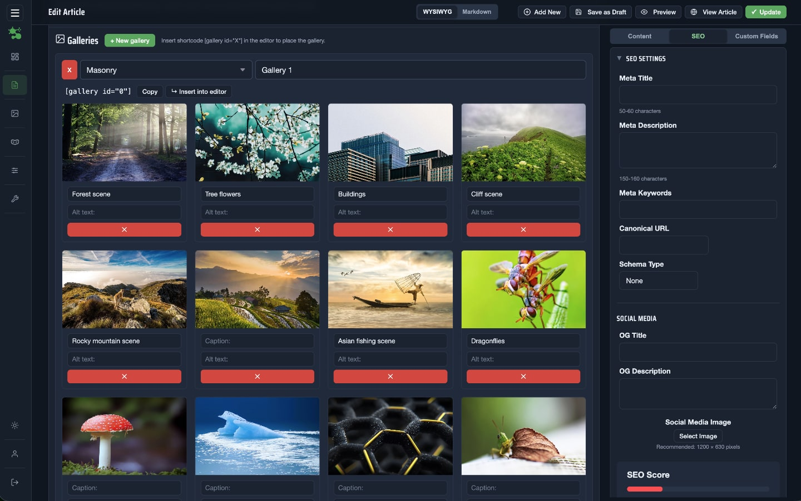

<div align="center">

# If you like Synaptik CMS, please give it a Star! ⭐


# SynaptikCMS

**A full-featured flat-file PHP CMS built for speed and simplicity. JSON storage, no database, no dependencies — just upload to any server and go.**
<br><br>


<br><br>

[Live Demo](https://demo.synaptikcms.com/) · [Download Themes](https://synaptikcms.com/themes/) · [Download Plugins](https://synaptikcms.com/plugins/) · [Documentation](https://docs.synaptikcms.com/) · [Changelog](CHANGELOG.md) · [Report a Bug](https://github.com/synaptikcms/synaptik-cms/issues)
<br><br>







</div>

---

## What is SynaptikCMS?

SynaptikCMS is a flat-file content management system built in PHP. Content is stored as individual JSON files — no database engine, no configuration overhead, no moving parts.

It was built for developers, designers, artists, creative professionals, writers, bloggers, or anyone who wants a CMS that is fast by default, easy to deploy anywhere, and simple enough to theme from scratch without fighting a framework.

**Installed footprint: ~2MB.** Zero runtime dependencies beyond PHP.

---

## Why SynaptikCMS?

| | SynaptikCMS | WordPress | Grav | Kirby | Bludit | Typemill |
|---|---|---|---|---|---|---|
| Database required | ✗ | MySQL | ✗ | ✗ | ✗ | ✗ |
| Admin panel included | ✓ | ✓ | Plugin | ✓ | ✓ | ✓ |
| WYSIWYG + Markdown | ✓ | ✓ | ✗ | ✓ | ✓ | ✓ |
| Theme system | ✓ hooks/filters | ✓ | ✓ | ✓ | ✓ | ✓ Twig |
| Plugin system | ✓ | ✓ | ✓ | ✓ | ✓ | ✓ |
| One-click updates | ✓ core/themes/plugins | ✓ | ✓ | ✓ | ✓ | ✓ |
| Built-in i18n | ✓ EN/FR/ES | Plugin | ✓ | ✓ | ✓ | ✓ |
| Image optimization | ✓ built-in | Plugin | Plugin | Plugin | Plugin | Plugin |
| Built-in analytics | ✓ plugin | Plugin | Plugin | Plugin | Plugin | Plugin |
| Composer required | ✗ | ✗ | ✓ | ✓ | ✗ | ✓ |
| Install footprint | ~2 MB | ~86 MB | ~52 MB | ~20 MB | ~9 MB | ~10 MB |
| License | SynaptikCMS OL | GPL free | MIT free | Paid | MIT free | MIT free |
| Install time | ~2 min | ~10 min | ~5 min | ~5 min | ~3 min | ~5 min |

SynaptikCMS is not trying to replace WordPress at scale. It is the right tool when you want a real admin panel with no database — for portfolios, documentation sites, small business sites, personal blogs or any project where simplicity and load speed matter.

---

## Installation

No composer. No npm. No database setup.

1. Download the [latest release ZIP](https://synaptikcms.com/files/releases/synaptikcms-latest.zip)
2. Extract and upload the files to your server
3. Visit `yourdomain.com/install.php` (or `yourdomain.com/subfolder/install.php`) and complete the setup wizard (site name, language, admin password, admin folder name)

**That's it.** You're running.
<br><br>

> ⚠️ Always run `install.php` before using the CMS. See the [installation guide](https://docs.synaptikcms.com/getting-started/#toc-installation) for details.
<br><br>

**Note:** The default install package ships only with the default theme. You can download clean, beautiful and responsive free themes for your Synaptik installation on the [Official Website's Themes Page](https://synaptikcms.com/themes/).
If you wish to extend the functionalities of your CMS, official plugins can be found [on this page](https://synaptikcms.com/plugins/).

---

## Features

### Content
- **3 content types** — Articles, Pages, Projects (Portfolio)
- **WYSIWYG and Markdown editors** — switch per post, content preserved
- **Draft system** — autosave at user-defined intervals, one-click publish
- **Scheduled publication** — set a future date, CMS publishes automatically
- **Categories and Tags** — hierarchical categories (up to 3 levels), tag management, merge and purge orphans
- **Custom Fields** — define extra fields per content type, use them in your theme
- **Related Content** — manual selection or automatic suggestions based on shared tags and categories
- **Image Galleries** — one or more galleries per post, 4 layouts: grid, masonry, justified, carousel
- **Shortcodes** — `[toc]`, `[gallery]`, `[callout]`, `[quote]`, `[button]`, `[recent_articles]`, `[recent_projects]`, `[articles_by_tag]`, `[contact_form]`

### Admin Panel
- **Media Manager** — upload, browse, rename, move with drag and drop, optional automatic compression/resizing upon upload
- **Batch Image Optimizer** — batch compression and resizing of images in user-chosen folders
- **Menu Builder** — drag and drop custom navigation, nested items, external links
- **Template Editor** — live-edit your active theme files with automatic backup before each save
- **SEO Overview** — audit meta titles, descriptions and keywords across all content in one view
- **Alt Text Assistant** — bulk-edit alt text and captions for gallery images
- **Sitemap Generator** — one-click XML sitemap, submit URL shown inline
- **Backup and Restore** — full ZIP backup of `/data/`, `/files/` and settings; restore in one click
- **Automatic Updates** — one-click updates for the CMS core, themes, and plugins, with an automatic safety backup before each update
- **Translation Editor** — add or edit translations with the built-in editor (both for back-end and front-end), or simply customize the text strings displayed on your site

### Themes
- Hook and filter system for theme developers
- Partials for article and project cards
- Live theme preview without activating
- Theme upload via ZIP with validation
- Theme manager with activate and delete
- Ships with default theme: `Mono`. More themes can be downloaded at [https://synaptikcms.com/themes/](https://synaptikcms.com/themes/)
- Full theme developer documentation at [https://docs.synaptikcms.com/theming/theming-guide/](https://docs.synaptikcms.com/theming/theming-guide/)

### Plugins
- Self-contained extensions under `/plugins/` — own routing, data storage, and admin screens, with zero core file edits required
- Plugin pages render inside the real admin panel (sidebar entry, standard layout) once activated
- Install by uploading a `.zip` from **Admin → Tools → Extensions**, activate and deactivate with one click
- Activation state tracked separately from installation — deactivating a plugin preserves its data
- Official plugins can be downloaded at [https://synaptikcms.com/plugins/](https://synaptikcms.com/plugins/)
- Full plugin developer documentation at [https://docs.synaptikcms.com/tools/plugin-system/](https://docs.synaptikcms.com/tools/plugin-system/)

### SEO and Performance
- Meta title, description, keywords per content item
- Open Graph and Twitter Card tags
- JSON-LD schema markup
- Canonical URLs
- RSS feed auto-injected in `<head>`
- Per-request cache for settings and content indexes
- Split-file architecture — single item pages load exactly one JSON file

### Internationalisation
- Front-end and admin panel fully localised
- Ships with English, French, Spanish
- Add a new language by dropping a JSON file in `/lang/` or by using the built-in translation editor

---

## System Requirements

### Server

| Requirement | Minimum | Notes |
|---|---|---|
| Web server | Apache 2.2+ | Nginx works but requires manual rewrite config |
| PHP | **8.3+** | |
| Database | — | **None required** |

### PHP Extensions

**Required**

| Extension | Used for |
|---|---|
| `json` | All read/write on `.json` data files |
| `mbstring` | Search, contact form validation, UTF-8 string ops |
| `hash` | HMAC tokens (CSRF, theme preview signing) |
| `session` | Admin authentication |
| `pcre` | Slug sanitisation, HTML purification, content parsing |
| `filter` | Email validation in contact form |
| `fileinfo` | MIME type detection on file uploads |

**Required for image features**

| Extension | Used for |
|---|---|
| `gd` | Image resizing, thumbnails, JPEG/PNG/GIF optimisation |
| GD + JPEG | Handling `.jpg`/`.jpeg` uploads |
| GD + PNG | Handling `.png` uploads |

**Optional**

| Extension | Used for |
|---|---|
| GD + WebP | WebP conversion — gracefully disabled if absent |
| `ZipArchive` | Theme and plugin upload, and automatic updates |

### Apache

Required modules: `mod_rewrite`, `mod_authz_core`  
Required directive: `AllowOverride All` on the document root

The CMS ships with a root `.htaccess` handling URL routing, security headers and cache rules:

```apacheconf
RewriteEngine On
RewriteCond %{REQUEST_FILENAME} !-f
RewriteCond %{REQUEST_FILENAME} !-d
RewriteRule ^(.*)$ index.php [QSA,L]
```

### Nginx (not officially supported)

A sample configuration is provided in `nginx.conf.example` at the root of the package. The critical sections cover sensitive directory blocks, PHP execution rules, and security headers. Copy and adapt it to your server block. At minimum, you need:

```nginx
location / {
    try_files $uri $uri/ /index.php?$query_string;
}
location ~ ^/(data|bckps|private|cache|lang)(/|$) { deny all; }
location ~ /(config\.json|admin-credentials\.php|plugins\.json|install\.lock)$ { deny all; }
location ~ ^/plugins/[^/]+/(data|private)(/|$) { deny all; }
location ~ /\. { deny all; }
```

See `nginx.conf.example` for the full recommended configuration including security headers and the `core/` allow-list.

### Filesystem Permissions

The following paths must be writable by the PHP process:

| Path | Required for |
|---|---|
| `/` | `config.json`, `install.lock` during setup |
| `/data/` | All content read/write |
| `/files/` | Media uploads |
| `/bckps/` | Backups, CSRF secret |
| `/admin/` | Credentials, draft autosave |
| `/theme/` | Theme ZIP upload |
| `/plugins/` | Plugin ZIP upload and each plugin's own data storage |

Recommended: `755` for directories, `644` for files.

### Browser (Admin Panel)

| Browser | Minimum |
|---|---|
| Chrome / Edge | 80+ |
| Firefox | 75+ |
| Safari | 13.1+ |

Internet Explorer is not supported.

### Setup Checklist

```
[ ] Apache 2.2+ with mod_rewrite enabled
[ ] AllowOverride All on the document root
[ ] PHP 8.3+
[ ] Extensions: json, mbstring, hash, session, pcre, filter, fileinfo
[ ] GD with JPEG and PNG support
[ ] ZipArchive recommended (theme/plugin upload, auto-updates)
[ ] Root .htaccess in place
[ ] Write permissions on: /, /data/, /files/, /bckps/, /admin/, /theme/, /plugins/
```

---

## Theming

Themes live in `/theme/{theme-name}/`. A minimal theme requires:

```
theme/
└── my-theme/
    ├── css/
    │   └── style.css
    ├── header.php
    ├── footer.php
    └── home.php
```

Optional overrides: `content-articles.php`, `content-pages.php`, `content-projects.php`, `content-list.php`, `404.php`, `functions.php`, `page-templates/`, `partials/`.

The Theme API exposes hooks (`add_action`), filters (`add_filter`), and helpers (`render_site_logo`, `render_header_scripts`, `render_navigation`, etc.). See the documentation for the full reference.

---

## Plugins

Plugins live in `/plugins/{plugin-name}/`. A minimal plugin requires:

```
plugins/
└── my-plugin/
    ├── plugin.json
    └── my-plugin-init.php
```

Unlike themes, plugins are not tied to the active theme — once activated from **Admin → Tools → Extensions**, a plugin runs regardless of which theme is in use, and can register its own admin sidebar entry and full admin page rendered inside the standard admin layout. See the [plugin system documentation](https://docs.synaptikcms.com/tools/plugin-system/) for the full developer reference: the plugin API, admin page rendering, front-end shortcode integration, session reuse, CSRF, i18n, and how to package a plugin for distribution.

---

## License

SynaptikCMS Open License — free for personal, educational, and non-profit use.
Commercial use requires visible attribution ("Powered by SynaptikCMS") in the product UI.
Direct resale of the software is not permitted without written permission.

See [LICENSE.md](LICENSE.md) for the full terms.

---

## Contributing

Issues and pull requests are welcome. Please open an issue before submitting a large PR to discuss the change.

---

<div align="center">
Made with ❤️ by <a href="https://github.com/synaptikcms">@synaptikcms</a>
</div>
