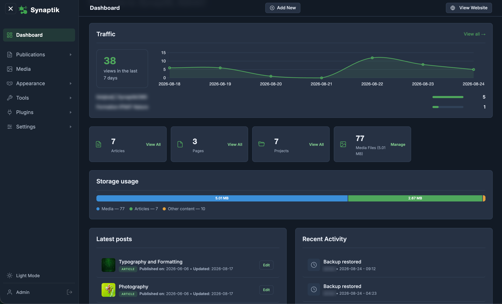
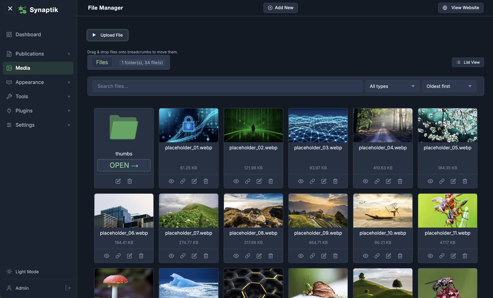

<div align="center">

# If you like Synaptik CMS, please give it a Star! ⭐

# SynaptikCMS

**A full-featured flat-file PHP CMS built for speed and simplicity. JSON storage, no database, no dependencies — just upload to any server and start creating!**
<br><br>


<br><br>

[Live Demo](https://demo.synaptikcms.com/) · [Download Themes](https://synaptikcms.com/themes/) · [Download Plugins](https://synaptikcms.com/plugins/) · [Documentation](https://docs.synaptikcms.com/) · [Changelog](CHANGELOG.md) · [Report a Bug](https://github.com/synaptikcms/synaptik-cms/issues)
<br><br>






</div>

---

## What is SynaptikCMS?

SynaptikCMS is a flat-file CMS: content lives in JSON files, not a database. No MySQL to configure, no ORM, no build step — extract the ZIP, run the installer, and you have a full admin panel.

Built for developers, designers, artists, writers or anyone who want a CMS that's fast by default, trivial to deploy on any shared host, and simple enough to theme from scratch.

- **No database** — content stored as individual JSON files, zero setup
- **2MB installed footprint**, zero runtime dependencies, no Composer/npm
- **Full admin panel** — WYSIWYG + Markdown editors, media manager, menu builder, live template editor and much more
- **Themes & plugins** — one-click ZIP install, one-click core/theme/plugin updates, hook/filter API
- **Built-in i18n** — English, French, Spanish out of the box, front-end and admin
- **Externally security-audited**

Whether you run portfolio sites, documentation sites, business sites, personal blogs, SynaptikCMS is ideal for any project where simplicity and load speed matter. It is designed to run perfectly on any shared hosting environment.

---

## Installation

No Composer. No npm. No database setup.

1. Download the [latest release ZIP](https://synaptikcms.com/download.php?f=synaptik-cms)
2. Extract and upload the files to your server
3. Visit `yourdomain.com/install.php` (or `yourdomain.com/subfolder/install.php`) and create your account.

**That's it.** You're running.

> ⚠️ Always run `install.php` before using the CMS. See the [Installation Guide](https://docs.synaptikcms.com/getting-started/#toc-installing-your-site) for details.

**Note:** The default install package ships only with the default theme. Free, clean, responsive themes are available on the [official themes page](https://synaptikcms.com/themes/), and official plugins on the [plugins page](https://synaptikcms.com/plugins/).

---

## Highlights

**Content** — 3 content types (Articles, Pages, Projects) · WYSIWYG & Markdown editors · Drafts with autosave · Scheduled publication · Revisions history · Hierarchical categories & tags · Custom fields · Image galleries (grid/masonry/justified/carousel) · Shortcodes (`[toc]`, `[gallery]`, `[callout]`, `[contact_form]`, ...)

**Admin panel** — Drag-and-drop media manager with auto-compression · Batch image optimizer · Menu builder · Live template editor with auto-backup · SEO overview · Sitemap generator · One-click ZIP backup/restore · One-click updates for core, themes and plugins

**Developer** — Hook/filter theme API, partials for article & project cards · Self-contained plugin system, zero core edits required · Meta tags, Open Graph, LLMS.txt, JSON-LD, RSS out of the box · Per-request cache, split-file item pages

→ Full feature reference and screenshots at [docs.synaptikcms.com](https://docs.synaptikcms.com/)

---

## Requirements

- **PHP 8.0+**, Apache with `mod_rewrite` (or Nginx with a manual rewrite rule) — **no database**
- Standard extensions: `json`, `mbstring`, `hash`, `session`, `pcre`, `filter`, `fileinfo`, `gd` (with JPEG/PNG)
- `ZipArchive` recommended for theme/plugin uploads and automatic updates
- Write access on `/`, `/data/`, `/files/`, `/bckps/`, `/admin/`, `/theme/`, `/plugins/`

Full requirements, the Nginx sample config, and the filesystem permissions checklist: see the https://docs.synaptikcms.com/getting-started/#toc-installation.

---

## Theming

Themes live in `/theme/{theme-name}/`. A minimal theme requires:

```
theme/
└── my-theme/
    ├── css/
    │   └── style.css
    ├── header.php
    ├── footer.php
    └── home.php
```

The Theme API exposes hooks (`add_action`), filters (`add_filter`), and helpers (`render_site_logo`, `render_header_scripts`, `render_navigation`, etc.). Ships with a default theme, `Mono` — more themes at https://synaptikcms.com/themes/. Full [theming guide](https://docs.synaptikcms.com/theming/theming-guide/).

---

## Plugins

Plugins live in `/plugins/{plugin-name}/`, self-contained with their own routing, data storage and admin screens — no core file edits required. Install by uploading a `.zip` from **Admin → Tools → Extensions**, activate and deactivate with one click. Official plugins at [synaptikcms.com/plugins](https://synaptikcms.com/plugins/). Full [plugin developer documentation](https://docs.synaptikcms.com/tools/plugin-system/).

---

## License

MIT — free for personal and commercial use. See [LICENSE.md](LICENSE.md).

---

## Contributing

Issues and pull requests are welcome. Please open an issue before submitting a large PR to discuss the change.

---

<div align="center">
Made with ❤️ by <a href="https://github.com/synaptikcms">@synaptikcms</a>
</div>
